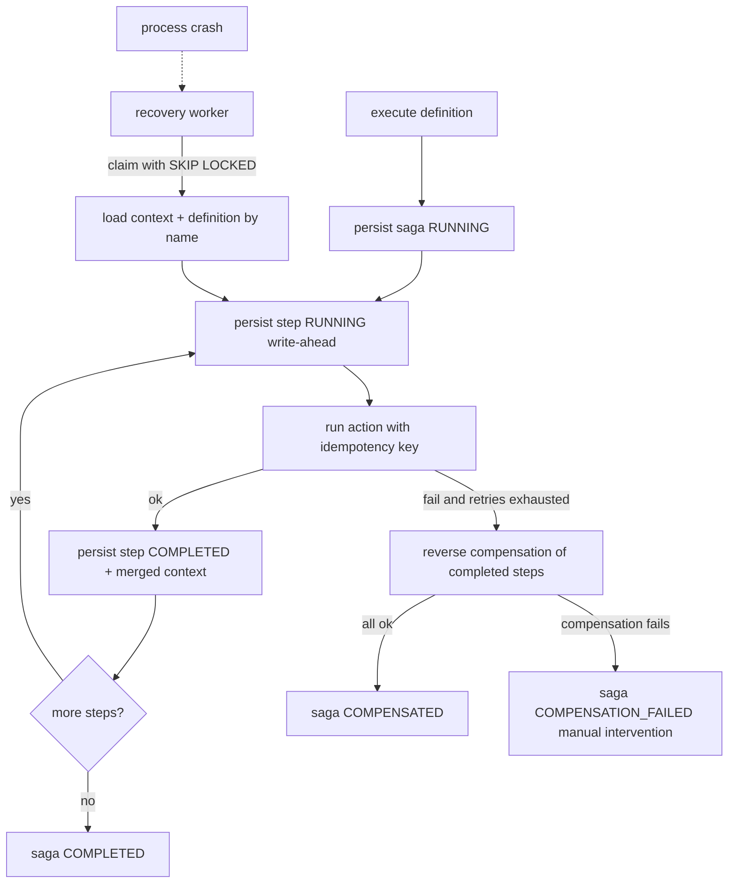

# SagaFlow Orchestrator Roadmap

A TypeScript saga-orchestration library managing distributed transactions across microservices, built as a pnpm monorepo. The roadmap front-loads every decision that affects **correctness** or the **public API** (idempotency, define-vs-run separation, leasing, transactional outbox) so later phases are additive, not rewrites.

## Guiding principles

- `saga-core` has **zero runtime dependencies**. `pg`, `kafkajs`, etc. live in adapter packages behind interfaces.
- **Define vs run are separated.** A `SagaBuilder` produces an immutable, named `SagaDefinition` (data + named step functions). Both `execute()` and the recovery worker run a definition. Inline `.step().execute()` is sugar over this.
- **Idempotency is first-class.** Every step receives an idempotency key (`${sagaId}:${stepName}`) in context from day one; actions/compensations are expected to be idempotent.
- **Write-ahead persistence.** A step is persisted as `RUNNING` before its side effect runs, so recovery can detect in-flight work.

## Target package layout

```text
packages/
  saga-core/         # builder, definition, executor, compensation, retry/timeout, interfaces
  saga-persistence/  # SagaRepository + EventPublisher interfaces, shared types
  saga-postgres/     # pg adapter: repository, leasing, transactional outbox
  saga-kafka/        # kafka EventPublisher + outbox relay
  saga-recovery/     # recovery worker (claims orphaned sagas, resumes)
  saga-dashboard/    # NestJS API + Next.js UI
  examples/          # order-saga demo
docs/                # final structured documentation (last task)
```

## Execution and recovery flow



---

## Phase 1 - In-memory core (correctness)

Builds `SagaBuilder`, `SagaDefinition`, `SagaExecutor`, `CompensationExecutor`, and an in-memory repository. Statuses modeled in full including `COMPENSATION_FAILED`. Idempotency key injected into context. Fault-injection test harness introduced.

Deliverable: `Saga.create(ctx).step(...).execute()` runs forward, compensates in reverse on failure, all in memory, fully unit-tested with simulated step failures.

## Phase 2 - Postgres durability + recovery

`saga-persistence` interfaces; `saga-postgres` adapter with `saga_instances` / `saga_steps` / `outbox` tables, leasing columns (`owner_id`, `locked_until`, `heartbeat_at`), and `SELECT ... FOR UPDATE SKIP LOCKED` claiming. Named definition registry. Transactional outbox written in the same tx as state. `saga-recovery` worker resumes orphaned `RUNNING` sagas. Fault-injection harness asserts correct end-state after a crash at every persistence point.

Deliverable: kill the process mid-saga, restart, and the saga reaches a correct terminal state exactly once.

## Phase 3 - Retry + timeout + hooks

Retry policies (fixed, exponential, exponential+jitter), non-retryable error marking, separate (more aggressive) compensation retry policy, `AbortSignal`-based timeouts (documented as "unknown outcome"), and lifecycle hooks (`onStepStart`, `onStepComplete`, `onCompensate`, etc.).

## Phase 4 - Kafka events + observability

`EventPublisher` interface with in-memory + Kafka adapters. Kafka adapter is fed by the **outbox relay** (at-least-once, offset-tracked) to avoid the dual-write problem. OpenTelemetry spans per saga/step. Events: `SagaStarted`, `StepStarted`, `StepCompleted`, `SagaFailed`, `CompensationStarted`, `SagaCompleted`.

## Phase 5 - Dashboard + metrics

NestJS read API over Postgres; Next.js UI showing saga id, current step, execution time, retries, status, failure reason. Prometheus metrics.

## Final task - Documentation

After all phases are complete, create a `docs/` folder. Inside it, create a task-named subfolder containing a `README.md` documenting what was built. Concretely: one subfolder per phase under `docs/` (for example `docs/phase-1-in-memory-core/README.md`, `docs/phase-2-postgres-recovery/README.md`, ... ), each README describing that phase's deliverables, public API, and usage. A top-level `docs/saga-orchestrator/README.md` ties them together as an index.

## Decisions already baked in (no rewrite later)

- `action(ctx)` may return a `Partial<TContext>` patch that is merged + persisted atomically (clean persistence boundary).
- Durable sagas must be **named + registered**; inline closures remain valid only for non-durable in-memory mode.
- `COMPENSATION_FAILED` is a real terminal state with alerting.
- Outbox lands in Phase 2 (with persistence), not Phase 4.
